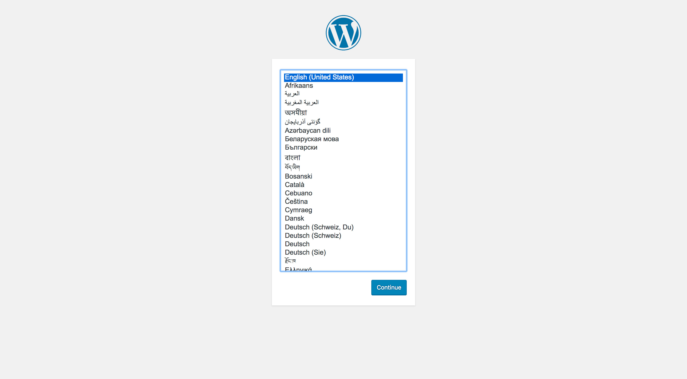

# How to build a WordPress Composer starter from scratch

## Prerequistes

I don't like having to muck about with settings and configuration and versions to run a command
or software for a programming language. So that's why I use docker to run scripts that
I don't want to install or manage on my computer.

- **Docker**
- **Git**
- **Terminal** (Sorry if your Windows, the commands work in Linux, MacOs)
- Maybe **Terraform** if you really want to

> That's it. Everything else, you should be able to do through Docker and Git.

## How to

### Running through the steps

This is just a step-by-step guide of what I did to create this starter. Sorry if it's missing any information. Create an issue if it is.

#### Create your root project directory

As standard. Name it whatever you want.

> mkdir whatever && cd whatever

#### Setup composer

> Why do we need PHP composer?
>
> Checkout Junior Grossi's post on [Why you should start using Composer](https://blog.jgrossi.com/2013/why-you-should-use-composer-and-how-to-start-using-it/)

```
docker run --rm -it -v $(pwd):/app composer /bin/sh -c "cd /app && composer init"
```

#### Write your docker compose stack

> /docker-compose.yml

```
version: "3.3"

services:
  db:
    image: mysql:5.7
    volumes:
      - db_data:/var/lib/mysql
    restart: always
    environment:
      MYSQL_ROOT_PASSWORD: wordpress
      MYSQL_DATABASE: wordpress
      MYSQL_USER: wordpress
      MYSQL_PASSWORD: wordpress

  php:
    depends_on:
      - db
    image: php:7.1.26-fpm-alpine3.8
    volumes:
      - ./web:/var/www
      - ./vendor:/var/www/vendor

  web:
    depends_on:
      - db
      - php
    image: nginx:latest
    ports:
      - "8080:80"
    volumes:
      - ./web:/var/www
      - ./cicd/site.conf:/etc/nginx/conf.d/default.conf
    environment:
      WORDPRESS_DB_HOST: db:3306
      WORDPRESS_DB_USER: wordpress
      WORDPRESS_DB_PASSWORD: wordpress
      WORDPRESS_DB_NAME: wordpress

volumes:
  db_data: {}

```

#### Create your nginx config

It doesn't have to be nginx, it could teleraek; whatever you like.

> /cicd/site.conf

```nginx
server {
    index index.php index.html;
    server_name _;
    error_log  /var/log/nginx/error.log;
    access_log /var/log/nginx/access.log;
    root /var/www;

    location ~ \.php$ {
        try_files $uri =404;
        fastcgi_split_path_info ^(.+\.php)(/.+)$;
        fastcgi_pass php:9000;
        fastcgi_index index.php;
        include fastcgi_params;
        fastcgi_param SCRIPT_FILENAME $document_root$fastcgi_script_name;
        fastcgi_param PATH_INFO $fastcgi_path_info;
    }
}
```

#### Add a basic `php` page

> web/index.php

```php
<?php echo 'Hi there'; ?>
```

#### Fire up your docker stack

```
docker-compose up -d
```

#### Open up the browser

And go to `http://localhost:8080`

You should see "Hi there".

### Adding WordPress

#### Update the composer file

You'll now be able to install WordPress as a dependency.
Update your composer file to look like this:

```json
{
  "name": "pixelex/wp",
  "type": "project",
  "authors": [
    {
      "name": "Gemma Black",
      "email": "gblackuk@googlemail.com"
    }
  ],
  "repositories": [
    {
      "type": "composer",
      "url": "https://wpackagist.org"
    }
  ],
  "require": {
    "johnpbloch/wordpress": ">=4.9"
  },
  "minimum-stability": "dev",
  "prefer-stable": true,
  "extra": {
    "wordpress-install-dir": "web/wp"
  }
}
```

#### Ignore unnecessary folders

> .gitignore

```
**/vendor/**
**/web/wp/**
```

#### Run a composer update

```
docker run --rm -it -v $(pwd):/app composer /bin/sh -c "cd /app && composer update"
```

You have WordPress. Great! But now it's locked away in a subdirectory.

#### Help Nginx see your WordPress folder

Update to this in your site.conf

> /cicd/site.conf

```
server {
    index index.php index.html;
    server_name _;
    error_log  /var/log/nginx/error.log;
    access_log /var/log/nginx/access.log;
    root /var/www/wp;

    location / {
        # This is cool because no php is touched for static content.
        # include the "$is_args$args" so non-default permalinks doesn't break when using query string
        try_files $uri $uri/ /index.php$is_args$args;
    }

    error_page 404 /404.html;

    error_page 500 502 503 504 /50x.html;
    location = /50x.html {
        root /usr/share/nginx/html;
    }

    location ~ \.php$ {
        try_files $uri =404;
        fastcgi_split_path_info ^(.+\.php)(/.+)$;
        fastcgi_pass php:9000;
        fastcgi_index index.php;
        include fastcgi_params;
        fastcgi_param SCRIPT_FILENAME $document_root$fastcgi_script_name;
        fastcgi_param PATH_INFO $fastcgi_path_info;
    }
}
```

#### Now you can start your 5 minute install (but not yet)

Restart nginx...actually your whole everything.

```
docker-compose down
docker-compose up -d
```

Now go back to `http://localhost:8080` and you'll see



#### Hmmm...PHP will need a way to connect to mysql

Create a Docker file

> cicd/php.dockerfile

```dockerfile
FROM php:7.2.15-fpm-alpine3.9
RUN docker-php-ext-install mysqli
```
